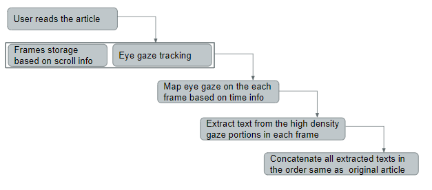

# Perosnalized-Summarization-using-Eye-Gaze
We develop WikiGaze, a standalone platform-independent tool to automatically generate personalized summaries for readers. It uses a state-of-the-art method to generate the summaries through eye gaze tracking of readers. We show the efficiency of a personalized summary generation method by collecting user reviews and by comparing it with the present state-of-the-art summarization techniques. 

# Language
Python
C

# Flow Chart

# Application Run
cd Integration
python new_main.py

# Application Usage Procedure
Participants are required to follow the following steps during dataset collection:

<ol style="list-style-type:lower-roman">
  <li>Start the application and click on the summarize button.</li>
  <li>Perform calibration procedure by following the dot appearing on-screen.</li>
  <li>Start reading any Wikipedia article of your choice.</li>
  <li>Upon finishing the reading session, we will display the text that you focused while reading. Do the following as per your wish:</li>
    <ol style="list-style-type:lower-roman">
    <li>If you are satisfied with the text extraction, click on the Save button.</li>
    <li>If you don’t like the text extraction, click on the discard button.</li>
    </ol>
  <li>In the end, please rate the text extraction as per your satisfaction level.</li>  
</ol>
